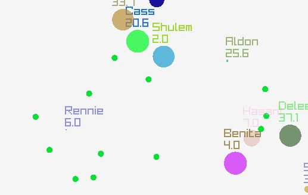

# Blobs
A graphical 2D simulation of living blobs that eat food and also each other

# What Is The Goal?
The goal was to create a simulation where through natural selection and high diversity interesting behaviors from real evolution will arise like camouflaging and fear of certain colors.

# Features
* Many randomly-selected properties for blobs such as speed, need for food, attack, field of view, and many more
* Visual representation for health of blobs
* Randomly spawning food and blobs
* Randomly selected names for each blob 
* Blobs can collide and kill each other
* Dead blobs turn into food
* Selecting and dragging blobs around the screen and pressing the space-bar spawns new blobs

## Implementation
* Collision detection is written by hand and uses a sweep-and-prune approch for faster performance and easy implementation
* Uses raylib for windows and graphics
* Flexible code for future additional features

## Inspiration
Thank you Gal, for inspiring me to shamelessly copy your amazing ideas many times. Thank you Asaf, for inpiring me to learn new things. Thank you Oshri, for inspiring me to finish my projects and helping me with them.
